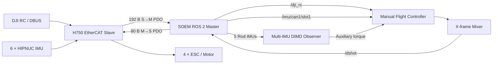
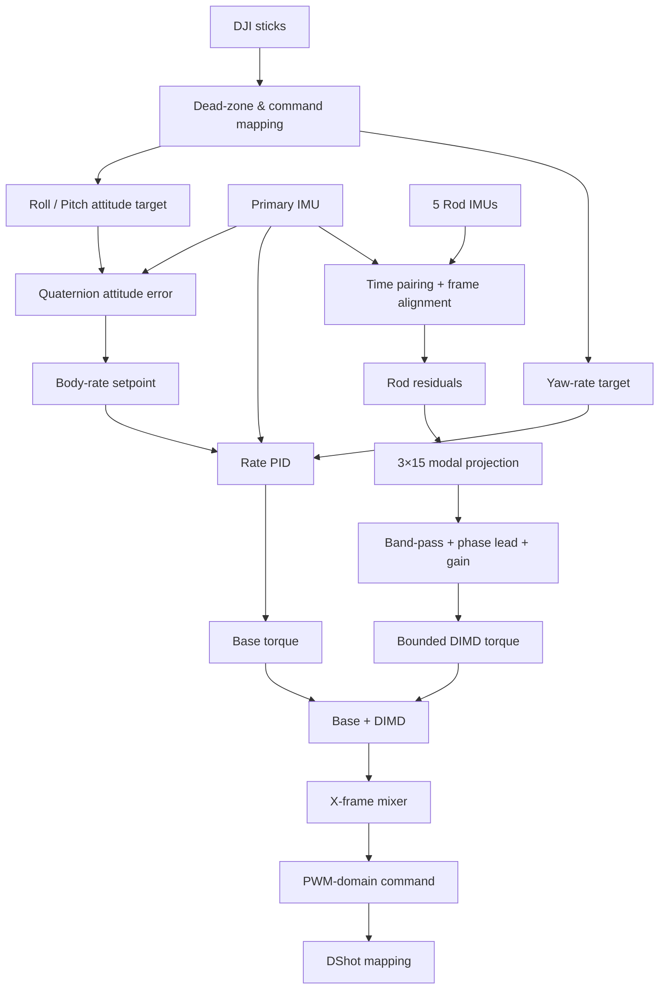

<div align="center">

# ZLT

### EtherCAT Quadrotor Control & Multi-IMU Structural Damping Stack

**ROS 2 · SOEM EtherCAT · 6× HIPNUC IMU · DJI RC · DShot · DIMD**

[](https://docs.ros.org/en/humble/)
[](https://releases.ubuntu.com/22.04/)
[](https://github.com/OpenEtherCATsociety/SOEM)
[](#flight-control-pipeline)
[](#ethercat-pdo-layout)

A research-oriented quadrotor control workspace that connects a custom **EtherCAT H750 slave** to ROS 2, reads **six synchronized IMUs + DJI DBUS remote control**, and writes **4-channel DShot motor commands**. The flight controller combines a quaternion attitude outer loop, angular-rate PID inner loop, X-frame motor mixing, and an optional multi-IMU **DIMD structural-vibration damping** branch.

</div>

---

## System Overview



### What this repository contains

| Layer | Purpose |
|---|---|
| `src/EcatV2_Master` | EtherCAT master core, custom ROS 2 messages, SOEM wrapper and task implementations |
| `src/soem_bringup` | ZLT-specific EtherCAT slave/task configuration and launch file |
| `soft_drone_manual_controller` | DJI RC manual flight controller, 6-IMU observer and DIMD damping logic |

> `src/EcatV2_Master` is a Git submodule pinned to the ZLT-compatible `feature/6imu-rc-dshot-pdo-v006` line.

---

## EtherCAT PDO Layout

The current configuration targets **ProductCode `0x06`** and slave serial **`sn2883658`** with **8 tasks**:

| Task | Direction | PDO offset | ROS 2 topic | Role |
|---:|---|---:|---|---|
| 1 | S → M | 0 B | `/imu/can1/slot1` | Primary / flight-control IMU |
| 2 | S → M | 21 B | `/imu/can1/slot2` | Rod IMU 0 / legacy DIMD secondary |
| 3 | S → M | 42 B | `/imu/can1/slot3` | Rod IMU 1 |
| 4 | S → M | 63 B | `/imu/can2/slot1` | Rod IMU 2 |
| 5 | S → M | 84 B | `/imu/can2/slot2` | Rod IMU 3 |
| 6 | S → M | 105 B | `/imu/can2/slot3` | Rod IMU 4 |
| 7 | S → M | 160 B | `/dji_rc` | DJI DBUS remote control |
| 8 | M → S | 0 B | `/dshot` | 4-channel DShot output |

### Buffer map

```text
Slave → Master (192 B)
┌────────────────────── 0 ... 125 ──────────────────────┐
│ 6 × HIPNUC IMU samples, 21 B each                     │
├──────────────────── 126 ... 159 ──────────────────────┤
│ 6-IMU sequence counters + CAN diagnostics             │
├──────────────────── 160 ... 178 ──────────────────────┤
│ DJI RC / DBUS: 18 raw bytes + online flag             │
├──────────────────── 179 ... 191 ──────────────────────┤
│ Reserved                                               │
└────────────────────────────────────────────────────────┘

Master → Slave (80 B)
┌──────────────────────── 0 ... 7 ───────────────────────┐
│ DShot: 4 × uint16                                      │
├──────────────────────── 8 ... 79 ──────────────────────┤
│ Reserved                                               │
└────────────────────────────────────────────────────────┘
```

The six IMUs carry per-sensor sequence counters so the master can detect stale, incomplete or skipped samples instead of blindly publishing every received EtherCAT frame.

---

## Flight-Control Pipeline



### Base controller

The **primary IMU only** participates in normal flight control and flight-safety decisions:

- quaternion attitude outer loop for roll and pitch;
- angular-rate PID inner loops for roll, pitch and yaw;
- DJI RC arming / disarming logic;
- RC and primary-IMU timeout failsafe;
- X-frame motor mixing and DShot generation.

The current controller loop target is **1000 Hz**.

### Multi-IMU DIMD branch

The remaining five IMUs are structural observers. Their angular-rate residuals are formed relative to the primary IMU and projected through a configurable **`3 × 15` modal projection matrix**:

```text
[rod0 xyz, rod1 xyz, rod2 xyz, rod3 xyz, rod4 xyz]
                    ↓
                 3 × 15 P
                    ↓
             modal-rate signal
                    ↓
        band-pass → phase lead → gain
                    ↓
             bounded τ_DIMD
```

The current safe compatibility configuration selects **rod0 only**, preserving the previous two-IMU behavior while the other four IMUs remain available for modal identification and future multi-point damping.

Current experimental DIMD tuning in `manual_controller.yaml`:

```yaml
dimd_center_frequency_hz: 9.3
dimd_bandwidth_hz: 3.0
dimd_gain_xyz: [0.0, 0.01, 0.0]
dimd_phase_lead_deg_xyz: [0.0, 90.0, 0.0]
dimd_torque_limit_xyz: [0.0, 0.002, 0.0]
```

---

## Coordinate Convention

HIPNUC data is converted from **FLU** to the controller's **FRD** frame before it enters flight-control or DIMD calculations:

```text
Quaternion : [w, x, y, z] → [w, x, -y, -z]
Gyroscope  : [x, y, z]    → [x, -y, -z]

FLU : x forward, y left,  z up
FRD : x forward, y right, z down
```

Additional rod-to-primary calibration matrices are applied **after** this conversion.

---

## Quick Start

### 1. Clone with submodules

```bash
git clone --recurse-submodules https://github.com/ssybh2/ZLT.git
cd ZLT

git submodule sync --recursive
git submodule update --init --recursive
```

### 2. Check the EtherCAT interface

The current `soem_bringup` launch file uses:

```text
interface   = enp1s0
rt_cpu      = 7
non_rt_cpus = 0,1,2,3,4,5,6
```

Before running on another computer, verify the Ethernet interface name and CPU layout:

```bash
ip link
lscpu
```

Then update `src/soem_bringup/launch/bringup.launch.py` if necessary.

### 3. Build

```bash
source /opt/ros/humble/setup.bash
colcon build --symlink-install
source install/setup.bash
```

### 4. Start the EtherCAT master

```bash
ros2 launch soem_bringup bringup.launch.py
```

Expected topics include:

```bash
ros2 topic list | grep -E 'imu/can|dji_rc|dshot|latency'
```

### 5. Validate sensors before enabling motors

```bash
ros2 topic echo /imu/can1/slot1
ros2 topic echo /imu/can1/slot2
ros2 topic echo /dji_rc
```

### 6. Start the controller in dry-run mode

```bash
ros2 launch soft_drone_manual_controller manual_controller.launch.py dry_run:=true
```

Useful diagnostics:

```bash
ros2 topic echo /manual_drone/imu_angle_deg
ros2 topic echo /manual_drone/dimd/rod0/residual_rad_s
ros2 topic echo /manual_drone/motor_pwm_us
ros2 topic echo /manual_drone/armed
```

Only after the topic mapping, IMU signs, motor order and arming logic have been verified should `dry_run` be disabled.

---

## Safety Architecture

The controller is intentionally conservative around actuator output:

- arming can require a prior **LOCK → UNLOCK** switch cycle;
- throttle must be low before arming;
- loss of DJI RC or the **primary IMU** disarms the vehicle;
- a failed/stale rod IMU disables only the optional DIMD branch rather than replacing the primary flight-control path;
- DShot output is forced to its configured lock value while disarmed;
- `dry_run:=true` keeps all control/diagnostic calculations active while suppressing DShot publication.

> **Always remove propellers during first bring-up, PDO changes, IMU-axis changes, motor-order changes, mixer-sign changes or DIMD tuning.**

---

## Key Configuration Files

```text
ZLT/
├── src/
│   ├── EcatV2_Master/                     # Git submodule: SOEM EtherCAT master
│   └── soem_bringup/
│       ├── config/config.yaml             # ProductCode 0x06 / 8-task PDO map
│       └── launch/bringup.launch.py       # NIC + realtime CPU configuration
│
└── soft_drone_manual_controller/
    ├── config/manual_controller.yaml      # Flight-control + DIMD parameters
    ├── launch/manual_controller.launch.py
    └── soft_drone_manual_controller/
        ├── manual_controller.py           # Base controller / legacy dual-IMU DIMD
        └── manual_controller_6imu.py      # Current 6-IMU extension and entry point
```

---

## Diagnostics & Development

EtherCAT timing diagnostics include:

- WKC monitoring;
- raw PDO gap detection;
- loop-stall profiling;
- per-IMU sequence-jump detection;
- incomplete P1/P2/P3 sample detection;
- CAN FIFO lost/full/read-error counters;
- per-slave latency publication.

For the structural observer, each rod publishes:

```text
/manual_drone/dimd/rodN/gyro_aligned_rad_s
/manual_drone/dimd/rodN/residual_rad_s
/manual_drone/dimd/rodN/healthy
```

These signals are intended for experimental modal analysis and subsequent tuning of `dimd_rod_projection_matrix_flat`.

---

## Repository Status

This repository is an active research/control workspace. The current architecture prioritizes:

1. deterministic EtherCAT transport;
2. preservation of the proven primary-IMU flight-control path;
3. explicit safety fallback behavior;
4. synchronized multi-point structural sensing;
5. gradual extension from two-IMU damping to multi-IMU modal damping.

<div align="center">

**ZLT · Real-time EtherCAT flight control with multi-point structural sensing**

</div>
