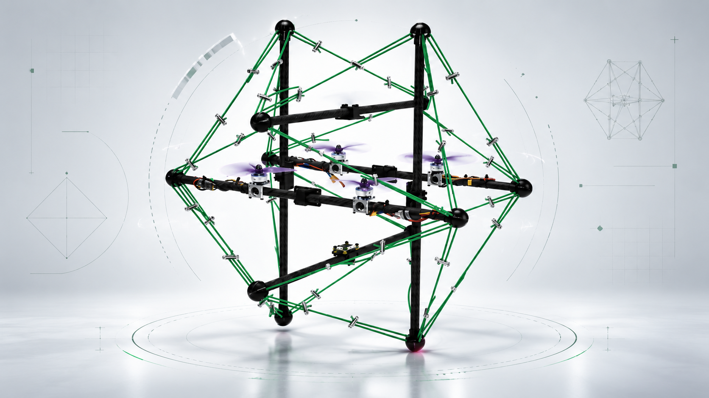

<div align="center">

# ZLT

**EtherCAT Quadrotor Control & Multi-IMU Structural Damping Stack**

<p>
  
  
  
  
</p>



</div>

<div align="center">
  <strong>Tensegrity + DIMD</strong><br>
  The tensegrity-inspired airframe provides compliant deformation paths that can absorb and redistribute disturbances. DIMD uses distributed multi-IMU measurements to observe internal structural motion and adds damping action to suppress oscillatory modes, aiming to reduce vibration seen by the main body and improve flight stability.
</div>

## Demo

<div align="center">
  
  <br>
  <sub>Real-flight demo</sub>
</div>

## Quick Start — `sn2031674-manual-rc-dshot` branch

This branch's four-task EtherCAT example is configured for **slave `sn2883650`**, not the historical `sn2031674` in the manual RC package name. Topic mapping: app1 = DJI RC, app2 = CAN1 IMU, app3 = CAN2 IMU, app4 = DShot. The `sn2031674_manual_rc` node is **open-loop RC → DShot**, not an IMU-stabilized flight controller. Its default `dry_run:=true` publishes no DShot commands.

See [sn2883650 RC → DShot launch guide](./sn2031674_manual_rc/README.md) for safety checks, ROS topics and a separate terminal per process.

```bash
git clone -b sn2031674-manual-rc-dshot --recurse-submodules \
    https://github.com/ssybh2/ZLT.git
cd ZLT

source /opt/ros/humble/setup.bash
colcon build --symlink-install --packages-up-to soem_bringup sn2031674_manual_rc
source install/setup.bash

# Terminal A: verify EtherCAT NIC (default: enp1s0) and configured slave first
ros2 launch soem_bringup bringup.launch.py

# Terminal B: source ROS and this workspace, then inspect the four /ecat/sn2883650/appN topics.
# Terminal C: source ROS and this workspace; start in safe dry-run mode:
ros2 launch sn2031674_manual_rc manual_rc.launch.py dry_run:=true
```

> The existing `soft_drone_manual_controller` default launch still targets a **different six-IMU layout** and should not run against this four-task example without a dedicated two-IMU control configuration and validation. Never run two simultaneous publishers to the DShot command topic. For motor tests, remove propellers and verify arming, motor order and emergency power-off capability.

---

<div align="center">
  <sub>Soft Robotics · Aerial Robotics · ROS 2 · EtherCAT</sub>
</div>
