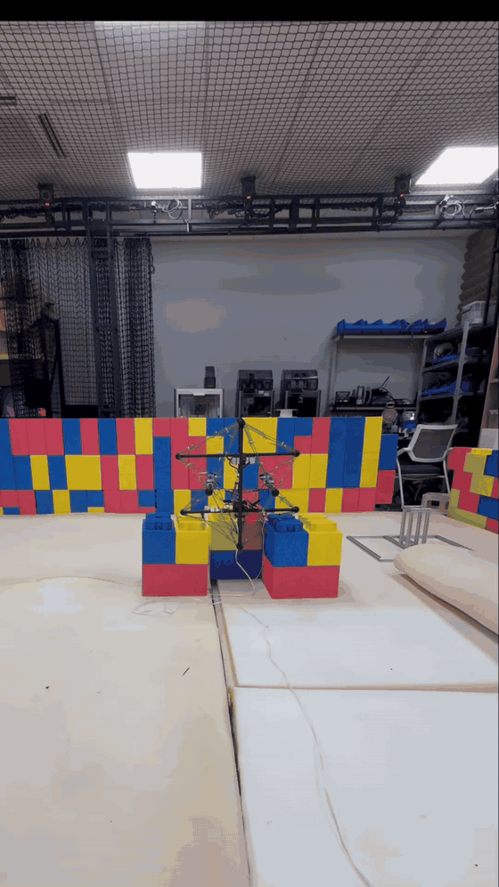

<div align="center">

# ZLT

**EtherCAT Quadrotor Control & Multi-IMU Structural Damping Stack**

<p>
  
  
  
  
</p>


</div>

## Demo

<div align="center">
  
  <br>
  <sub>Real-flight demo</sub>
</div>

## Quick Start

```bash
git clone --recurse-submodules https://github.com/ssybh2/ZLT.git
cd ZLT

source /opt/ros/humble/setup.bash
colcon build --symlink-install
source install/setup.bash

ros2 launch soem_bringup bringup.launch.py
ros2 launch soft_drone_manual_controller manual_controller.launch.py dry_run:=true
```

> Before first motor-enabled testing, verify the EtherCAT interface, IMU directions, motor order and arming logic with propellers removed.

---

<div align="center">
  <sub>Soft Robotics · Aerial Robotics · ROS 2 · EtherCAT</sub>
</div>
